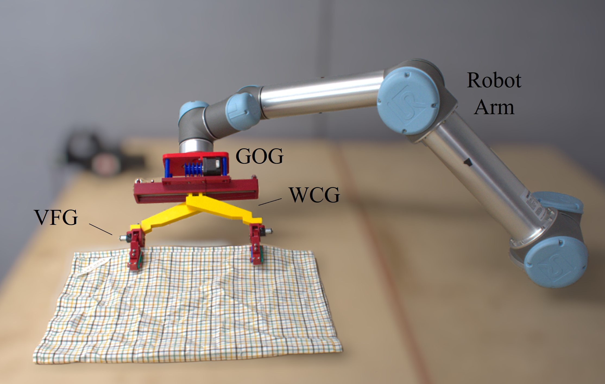

# GoG_hardware

  

CAD files for Gripper-on-Gripper (GoG) design. This gripper is specifically designed to facilitate bimanual cloth manipulation, including actions like folding and flattening, using a only a single robot arm. The gripper configuration comprises two distinct features: a Width Control Gripper (WCG) and two Variable Friction Gripper (VFG). 
- WCG functions as a large-scale gripper mechanism responsible for regulating the width of the two VFGS, with a range of up to 500mm. 
- Two VFGs consists of a variable friction module that enables to actuate two grasping modes passively
  - Firm grasp
  - Sliding grasp

For more in-depth information, please refer to our paper [[1]](https://ieeexplore.ieee.org/abstract/document/10410659) or [our webpage](https://sites.google.com/view/gripperongripper).

[1] Dongmyoung Lee*, Wei Chen*, Xiaoshuai Chen, and Nicolas Rojas. "GOG: A Versatile Gripper-On-Gripper Design for Bimanual Cloth Manipulation with a Single Robotic Arm." IEEE Robotics and Automation Letters (2024).
